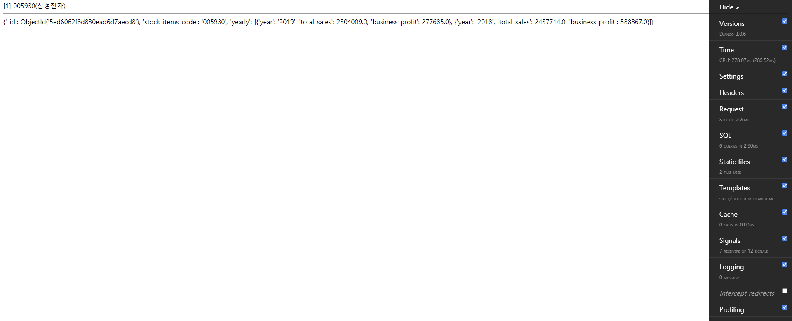

# MongoDB With Django

#### Before connect MongoDB, insert sample data
Insert Sample to collection **finance_info**
```
> db.finance_info.insert(
{
    "_id" : ObjectId("5ed6062f8d830ead6d7aecd8"),
    "stock_items_code" : "005930",
    "yearly" : [ 
        {
            "year" : "2019",
            "total_sales" : 2304009.0,
            "business_profit" : 277685.0
        }, 
        {
            "year" : "2018",
            "total_sales" : 2437714.0,
            "business_profit" : 588867.0
        }
    ]
})

WriteResult({ "nInserted" : 1 })
```

```
> db.finance_info.find()

{ "_id" : ObjectId("5ed6062f8d830ead6d7aecd8"), "stock_items_id" : "1", "yearly" : [ { "year" : "2019", "total_sales" : 2304009, "business_profit" : 277685 }, { "year" : "2018", "total_sales" : 2437714, "business_profit" : 588867 } ] }
```

#### Create MongoDB Client
```
$ pip install pymongo
```

##### sample/stock/mongo_db.py
```
import pymongo

class MongoDB:
    _instance = None
    client = pymongo.MongoClient(host = '172.17.0.3', port = 27017, username = 'root', password = 'wpdlwl')
    db = client.backend

    def __new__(cls, *args, **kwargs):
        if not cls._instance:
            cls._instance = object.__new__(cls, *args, **kwargs)

        return cls._instance

    def find_one(self, collection_name, query):
        return self.db[collection_name].find_one(query)
```

##### sample/stock/views.py

```
from .models import Items
from .mongo_db import MongoDB

class StockItemDetail(LoginRequiredMixin, ListView):
    template_name = 'stock/stock_item_detail.html'
    context_object_name = 'stock_items'

    def get_queryset(self):
        return get_object_or_404(Items, code = self.kwargs['code'])

    def get_context_data(self, **kwargs):
        mongo = MongoDB()

        return {
            'view_title'  : 'Stock Detail',
            'stock_item'  : self.get_queryset(),
            'finance_info': mongo.find_one('finance_info', { "stock_items_code": self.kwargs['code'] })
        }
```

##### static/stock/stock_item_detail.html
```

{{ view_title }} 


    

    <script>
        $(document).ready(function () {

        });
    </script>




    {{ stock_item }}
    <hr>
    {{ finance_info }}


```
